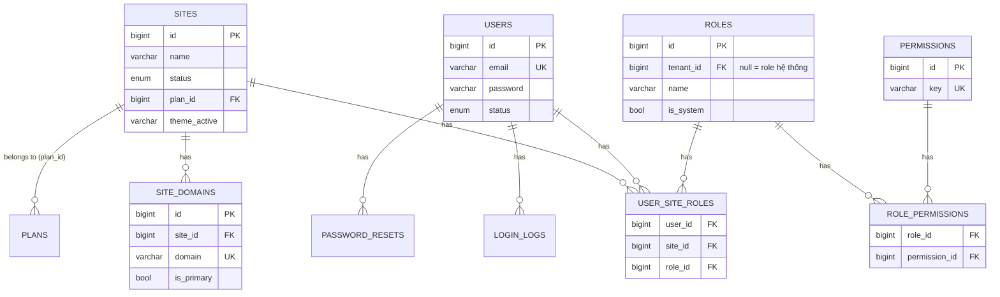
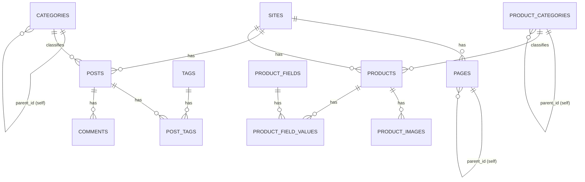
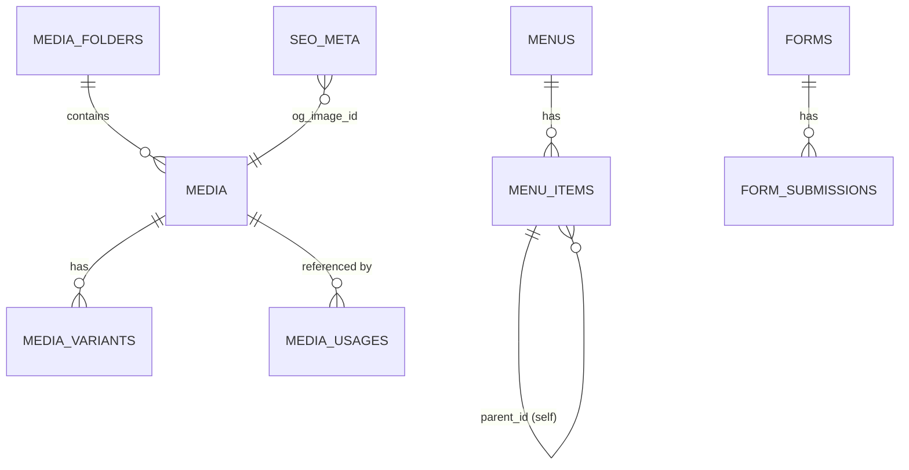
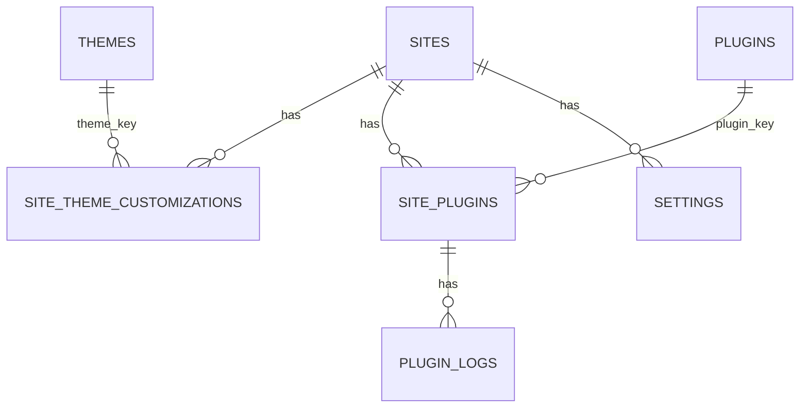

# THIẾT KẾ DATABASE CHI TIẾT — CMS ĐA WEBSITE

> Phạm vi: Thiết kế schema (ERD, Quan hệ, Index, Unique, Foreign Key, Trigger). **Không viết migration/code**, chỉ đặc tả cấu trúc.
> Giả định: MySQL 8+ / MariaDB 10.6+ (tương thích chuẩn `coding-standard.md`: PHP 8+, không ORM, tự viết Query Builder).
> Quy ước chung: `id` = `BIGINT UNSIGNED AUTO_INCREMENT PRIMARY KEY`; `tenant_id` = `BIGINT UNSIGNED` (FK → `sites.id`) xuất hiện ở **mọi bảng nghiệp vụ** (multi-tenant, đã chốt kiến trúc: 1 DB chung + tenant_id); `created_at`, `updated_at` = `TIMESTAMP` (dùng `ON UPDATE CURRENT_TIMESTAMP`, không cần trigger); `deleted_at` = `TIMESTAMP NULL` cho bảng cần soft-delete.

---

## 0. NGUYÊN TẮC THIẾT KẾ (giải thích trước khi vào chi tiết)

1. **Mọi bảng nghiệp vụ đều có `tenant_id` và đều được index kèm nó** — vì 100% truy vấn đi qua `WHERE tenant_id = ?` (đúng nguyên tắc multi-tenant đã chốt). Index luôn đặt `tenant_id` làm cột đầu trong composite index để tận dụng tối đa.
2. **Unique constraint luôn là composite `(tenant_id, slug)`**, không unique riêng `slug` — vì slug chỉ cần duy nhất *trong phạm vi 1 site*, hai site khác nhau có thể trùng slug.
3. **Foreign Key dùng `ON DELETE RESTRICT` làm mặc định** cho quan hệ tham chiếu nội dung (an toàn dữ liệu, tránh mất mát ngoài ý muốn) — chỉ dùng `CASCADE` cho quan hệ "con phụ thuộc hoàn toàn vào cha" (ví dụ `page_blocks` phụ thuộc `pages`, xoá Page thì xoá luôn block).
4. **[CẬP NHẬT — Quyết định chính thức] Không dùng Database Trigger cho Business Logic.** Toàn bộ logic nghiệp vụ (đảm bảo bất biến dữ liệu như "chỉ 1 Homepage/site", cập nhật số liệu tổng hợp như dung lượng lưu trữ, gửi email, gọi hook...) đều xử lý ở **Service Layer**, bọc trong **Database Transaction** khi thao tác ghi nhiều bảng/nhiều bước cùng lúc. Lý do: business logic phải nằm ở Service Layer (đúng SOLID); Trigger làm tăng độ phức tạp và khó debug (logic "ẩn" trong DB, không thấy được khi đọc code); khó Unit Test Trigger so với Service; không phụ thuộc vào 1 DB Engine cụ thể (dễ đổi MySQL → MariaDB hoặc engine khác sau này). Xem chi tiết áp dụng ở mục 6.

---

## 1. ERD TỔNG QUAN (nhóm theo miền dữ liệu)

### 1.1. Nhóm Tenant – Auth – User/Role



### 1.2. Nhóm Content (Page – Post – Product) + Category/Tag



### 1.3. Nhóm Media – Menu – Form – SEO



### 1.4. Nhóm Theme – Plugin – Settings



---

## 2. CHI TIẾT BẢNG — NHÓM TENANT / AUTH / USER / ROLE

### 2.1. `sites`

| Cột | Kiểu | Ghi chú |
|---|---|---|
| id | BIGINT UNSIGNED | PK |
| name | VARCHAR(150) | |
| status | ENUM('active','maintenance','suspended') | default 'active' |
| plan_id | BIGINT UNSIGNED NULL | FK → `plans.id` |
| theme_active | VARCHAR(100) | FK logic tới `themes.key` (không đặt FK cứng — xem giải thích bên dưới) |
| storage_used_bytes | BIGINT UNSIGNED | default 0 — **[bổ sung chính thức]** số liệu tổng hợp dung lượng đã dùng, cập nhật qua `MediaService` (xem mục 6.2), phục vụ giới hạn theo `plan` (Free/Basic/Pro/Enterprise) — nền tảng SaaS |
| created_at, updated_at | TIMESTAMP | |

- **Index**: `idx_sites_status (status)` — phục vụ Super Admin lọc site theo trạng thái.
- **Index bổ sung**: `idx_sites_plan_storage (plan_id, storage_used_bytes)` — phục vụ truy vấn "các site sắp/đã vượt giới hạn dung lượng theo plan" (dùng cho cảnh báo/khoá tính năng upload).
- **FK**: `plan_id → plans.id ON DELETE SET NULL` (xoá plan không được phép xoá luôn site, chỉ gỡ gán plan).
- **Giải thích `theme_active` không đặt FK cứng tới `themes.key`**: bảng `themes` chỉ là danh sách theme *đã cài vào hệ thống* (đọc từ filesystem `/themes`, đồng bộ vào DB), không phải nguồn dữ liệu gốc — nếu đặt FK cứng, việc gỡ 1 theme khỏi filesystem sẽ vướng ràng buộc DB. Việc kiểm tra "theme có tồn tại không" được xử lý ở Service layer (`ThemeService`) khi kích hoạt.

### 2.2. `site_domains`

| Cột | Kiểu | Ghi chú |
|---|---|---|
| id | BIGINT UNSIGNED | PK |
| site_id | BIGINT UNSIGNED | FK → `sites.id` |
| domain | VARCHAR(255) | |
| is_primary | BOOLEAN | default false |

- **Unique**: `uq_site_domains_domain (domain)` — 1 domain chỉ trỏ về đúng 1 site trong toàn hệ thống (đây là **ngoại lệ duy nhất** không unique theo tenant, vì bảng này chính là nơi *xác định* tenant).
- **Index**: `idx_site_domains_site_id (site_id)`.
- **FK**: `site_id → sites.id ON DELETE CASCADE` (xoá site thì xoá luôn domain gắn với nó — domain không có ý nghĩa đứng riêng).

### 2.3. `users`

| Cột | Kiểu | Ghi chú |
|---|---|---|
| id | BIGINT UNSIGNED | PK |
| name | VARCHAR(150) | |
| email | VARCHAR(190) | |
| password | VARCHAR(255) | hash |
| status | ENUM('active','locked','pending') | |
| created_at, updated_at | TIMESTAMP | |

- **Unique**: `uq_users_email (email)` — **không** theo tenant, vì 1 user (theo email) có thể dùng chung tài khoản để quản lý nhiều site (qua `user_site_roles`), đúng thiết kế "1 user - N site - N role" đã mô tả ở spec module User/Role.
- **Index**: `idx_users_status (status)`.

### 2.4. `roles`, `permissions`, `role_permissions`, `user_site_roles`

**`roles`**: `id`, `tenant_id NULL` (null = role mặc định toàn hệ thống như Admin/Editor, có giá trị = role tuỳ biến riêng của 1 site), `name`, `is_system BOOLEAN`.
- **Unique**: `uq_roles_tenant_name (tenant_id, name)`.
- **FK**: `tenant_id → sites.id ON DELETE CASCADE` (role riêng của site thì mất theo site; role hệ thống có `tenant_id NULL` không bị ảnh hưởng).

**`permissions`**: `id`, `key VARCHAR(100)` (vd `post.create`), `description`.
- **Unique**: `uq_permissions_key (key)` — bảng danh mục cố định toàn hệ thống, không theo tenant.

**`role_permissions`**: `role_id`, `permission_id` — **Composite PK** `(role_id, permission_id)`, không cần thêm `id` riêng.
- **FK**: cả 2 cột `ON DELETE CASCADE` (xoá role hoặc permission thì gỡ luôn liên kết).

**`user_site_roles`**: `id`, `user_id`, `site_id`, `role_id`.
- **Unique**: `uq_user_site_roles (user_id, site_id)` — **1 user chỉ có đúng 1 role trên 1 site tại 1 thời điểm** (tránh xung đột quyền — nếu cần nhiều role/site thì role đó phải gộp permission sẵn, không gán nhiều dòng).
- **Index**: `idx_user_site_roles_site_id (site_id)` — phục vụ truy vấn "danh sách user của site X" (Admin Flow module User/Role).
- **FK**: `user_id → users.id ON DELETE CASCADE`, `site_id → sites.id ON DELETE CASCADE`, `role_id → roles.id ON DELETE RESTRICT` (không cho xoá Role nếu đang có user dùng — buộc Admin phải chuyển user sang role khác trước, tránh user bỗng dưng mất hết quyền).

### 2.5. `password_resets`, `login_logs`, `personal_access_tokens`

**`password_resets`**: `id`, `user_id FK CASCADE`, `token VARCHAR(255)`, `expires_at`.
- **Unique**: `uq_password_resets_token (token)`.
- **Index**: `idx_password_resets_user_id (user_id)`.

**`login_logs`**: `id`, `user_id FK CASCADE`, `tenant_id FK CASCADE`, `ip`, `user_agent`, `created_at`.
- **Index**: `idx_login_logs_user_id_created_at (user_id, created_at)` — phục vụ truy vấn lịch sử đăng nhập gần nhất.

**`personal_access_tokens`**: `id`, `user_id FK CASCADE`, `token_hash VARCHAR(255)`, `expires_at`, `revoked_at NULL`.
- **Unique**: `uq_tokens_hash (token_hash)`.
- **Index**: `idx_tokens_user_id (user_id)`.

---

## 3. CHI TIẾT BẢNG — NHÓM CONTENT (PAGE / POST / PRODUCT)

### 3.1. `pages`

| Cột | Kiểu | Ghi chú |
|---|---|---|
| id | BIGINT UNSIGNED | PK |
| tenant_id | BIGINT UNSIGNED | FK |
| parent_id | BIGINT UNSIGNED NULL | FK self |
| title | VARCHAR(255) | |
| slug | VARCHAR(255) | |
| content | JSON | block-based |
| template | VARCHAR(100) | |
| status | ENUM('draft','published','scheduled') | |
| published_at | TIMESTAMP NULL | |
| is_homepage | BOOLEAN | default false |
| created_by | BIGINT UNSIGNED | FK → users.id |
| created_at, updated_at, deleted_at | TIMESTAMP | soft-delete |

- **Unique**: `uq_pages_tenant_slug (tenant_id, slug)`.
- **Index**: `idx_pages_tenant_status (tenant_id, status)`, `idx_pages_parent_id (parent_id)`.
- **FK**: `tenant_id → sites.id ON DELETE CASCADE`; `parent_id → pages.id ON DELETE SET NULL` (xoá Page cha thì Page con trở thành cấp gốc, không xoá dây chuyền — tránh mất nội dung ngoài ý muốn); `created_by → users.id ON DELETE RESTRICT` (không cho xoá user nếu còn Page do họ tạo — giữ toàn vẹn lịch sử nội dung; xử lý bằng cách khoá user thay vì xoá, đúng Admin Flow module User).
- **Ràng buộc nghiệp vụ đặc biệt "chỉ 1 Page là homepage/site"**: **[quyết định chính thức]** không dùng UNIQUE INDEX (MySQL không hỗ trợ partial unique index như Postgres) và **không dùng Trigger** — xử lý hoàn toàn ở `PageService::setHomepage()`, bọc trong Database Transaction (chi tiết mục 6.1).

### 3.2. `categories`, `tags`, `post_tags`, `posts`, `comments`

**`categories`**: `id`, `tenant_id FK`, `parent_id NULL FK self`, `name`, `slug`.
- **Unique**: `uq_categories_tenant_slug (tenant_id, slug)`.
- **FK**: `parent_id → categories.id ON DELETE SET NULL`.

**`tags`**: `id`, `tenant_id FK`, `name`, `slug`.
- **Unique**: `uq_tags_tenant_slug (tenant_id, slug)`.

**`posts`**: `id`, `tenant_id FK`, `title`, `slug`, `excerpt`, `content`, `featured_image_id NULL`, `category_id NULL`, `status`, `published_at`, `created_by`, `view_count INT UNSIGNED default 0`, timestamps + `deleted_at`.
- **Unique**: `uq_posts_tenant_slug (tenant_id, slug)`.
- **Index**: `idx_posts_tenant_status_published (tenant_id, status, published_at)` — phục vụ trực tiếp truy vấn danh sách blog (lọc + sắp xếp theo ngày, query phổ biến nhất của module Post); `idx_posts_category_id (category_id)`.
- **FK**: `category_id → categories.id ON DELETE SET NULL` (xoá category không xoá bài viết, chỉ gỡ phân loại); `featured_image_id → media.id ON DELETE SET NULL`.

**`post_tags`**: `post_id`, `tag_id` — Composite PK `(post_id, tag_id)`.
- **FK**: cả hai `ON DELETE CASCADE`.
- **Index bổ sung**: `idx_post_tags_tag_id (tag_id)` — vì Composite PK `(post_id, tag_id)` chỉ tối ưu truy vấn "tag của 1 post", cần thêm index riêng cho chiều ngược lại "bài viết theo 1 tag" (rất hay dùng ở trang Blog lọc theo tag).

**`comments`**: `id`, `post_id FK`, `name`, `email`, `content`, `status ENUM('pending','approved','spam')`, `created_at`.
- **Index**: `idx_comments_post_id_status (post_id, status)` — truy vấn phổ biến "lấy comment đã duyệt của 1 bài".
- **FK**: `post_id → posts.id ON DELETE CASCADE` (comment phụ thuộc hoàn toàn vào bài viết).

### 3.3. `product_categories`, `products`, `product_images`, `product_fields`, `product_field_values`

**`product_categories`**: cấu trúc tương tự `categories` (tenant_id, parent_id, name, slug), unique `(tenant_id, slug)`.

**`products`**: `id`, `tenant_id FK`, `category_id NULL FK`, `name`, `slug`, `description`, `price DECIMAL(15,2) NULL`, `status`, `created_by`, timestamps + `deleted_at`.
- **Unique**: `uq_products_tenant_slug (tenant_id, slug)`.
- **Index**: `idx_products_tenant_category (tenant_id, category_id)`, `idx_products_tenant_status (tenant_id, status)`.
- **FK**: `category_id → product_categories.id ON DELETE SET NULL`.

**`product_images`**: `id`, `product_id FK`, `media_id FK`, `sort_order INT`.
- **Unique**: `uq_product_images (product_id, media_id)` — tránh gắn trùng 1 ảnh 2 lần vào cùng sản phẩm.
- **FK**: `product_id → products.id ON DELETE CASCADE`; `media_id → media.id ON DELETE RESTRICT` (không cho xoá ảnh đang nằm trong gallery sản phẩm — đây chính là cơ chế "an toàn cuối cùng" bổ sung cho `media_usages`, xem giải thích mục 4).

**`product_fields`**: `id`, `tenant_id FK`, `key VARCHAR(100)`, `label`, `type ENUM('text','number','select')`.
- **Unique**: `uq_product_fields_tenant_key (tenant_id, key)`.

**`product_field_values`**: `product_id FK`, `field_id FK`, `value TEXT`.
- **Composite PK**: `(product_id, field_id)`.
- **FK**: `product_id ON DELETE CASCADE`, `field_id ON DELETE CASCADE` (xoá field định nghĩa thì toàn bộ giá trị đã nhập theo field đó cũng không còn ý nghĩa).

---

## 4. CHI TIẾT BẢNG — MEDIA

### 4.1. `media_folders`, `media`, `media_variants`, `media_usages`

**`media_folders`**: `id`, `tenant_id FK`, `parent_id NULL FK self`, `name`.

**`media`**: `id`, `tenant_id FK`, `folder_id NULL FK`, `file_name`, `path`, `mime_type`, `size BIGINT UNSIGNED`, `alt_text`, `title`, `caption`, `uploaded_by FK users`, `created_at`.
- **Index**: `idx_media_tenant_folder (tenant_id, folder_id)`, `idx_media_mime_type (mime_type)` (lọc theo loại file).
- **FK**: `folder_id → media_folders.id ON DELETE SET NULL`; `uploaded_by → users.id ON DELETE RESTRICT`.

**`media_variants`**: `id`, `media_id FK`, `size_type ENUM('thumbnail','medium','large','webp')`, `path`, `width INT`, `height INT`.
- **Unique**: `uq_media_variants (media_id, size_type)` — 1 ảnh chỉ có đúng 1 bản mỗi loại size.
- **FK**: `media_id → media.id ON DELETE CASCADE` (variant phụ thuộc hoàn toàn vào ảnh gốc).

**`media_usages`**: `id`, `media_id FK`, `entity_type VARCHAR(50)`, `entity_id BIGINT UNSIGNED`.
- **Unique**: `uq_media_usages (media_id, entity_type, entity_id)` — tránh ghi trùng bản ghi sử dụng.
- **Index**: `idx_media_usages_entity (entity_type, entity_id)` — chiều truy vấn ngược "1 Page dùng những media nào".
- **FK**: `media_id → media.id ON DELETE RESTRICT`.

**Giải thích quan trọng — vì sao `media_usages` dùng `entity_type` + `entity_id` (polymorphic) thay vì FK cứng tới từng bảng:** vì Media được dùng chung bởi nhiều loại nội dung khác nhau (Page, Post, Product...), MySQL không hỗ trợ 1 FK trỏ tới nhiều bảng khác nhau. Đây là đánh đổi có chủ đích: mất khả năng ràng buộc FK cứng ở cột này, đổi lại có 1 bảng trung tâm dùng chung cho toàn bộ module nội dung (đúng nguyên tắc "Everything reusable" trong `design-system.md`). Bù lại rủi ro mất toàn vẹn dữ liệu, `media.id → RESTRICT` ở **cả `media_usages` lẫn `product_images`** đóng vai trò 2 lớp chặn xoá nhầm ảnh đang dùng.

---

## 5. CHI TIẾT BẢNG — MENU / FORM / SEO / SETTINGS / THEME / PLUGIN

### 5.1. `menus`, `menu_items`

**`menus`**: `id`, `tenant_id FK`, `name`, `location_key VARCHAR(50)`.
- **Unique**: `uq_menus_tenant_location (tenant_id, location_key)` — 1 vị trí (header/footer) chỉ gán đúng 1 Menu/site, tránh nhầm lẫn khi Theme render.

**`menu_items`**: `id`, `menu_id FK`, `parent_id NULL FK self`, `label`, `type ENUM('page','post_category','product_category','custom')`, `reference_id NULL`, `url NULL`, `target VARCHAR(20)`, `sort_order INT`.
- **Index**: `idx_menu_items_menu_id_sort (menu_id, sort_order)` — đúng truy vấn chính "lấy toàn bộ item theo menu, sắp xếp thứ tự".
- **FK**: `menu_id → menus.id ON DELETE CASCADE`; `parent_id → menu_items.id ON DELETE CASCADE` (mục con dropdown phụ thuộc hoàn toàn mục cha).
- **Lưu ý `reference_id`**: cũng là tham chiếu polymorphic (tuỳ `type` mà trỏ tới `pages.id`/`categories.id`/`product_categories.id`) → tương tự `media_usages`, không đặt FK cứng, việc resolve và kiểm tra tồn tại được xử lý ở `MenuService` khi render (nếu Page/Category đã bị xoá, ẩn mục Menu tương ứng thay vì lỗi).

### 5.2. `forms`, `form_submissions` — [CẬP NHẬT theo quyết định chính thức]

**`forms`**: `id`, `tenant_id FK`, `name`, `fields JSON`, `success_message`, `notify_email NULL`, `webhook_url NULL`, `status ENUM('active','archived') default 'active'`, `created_at`, `updated_at`, `deleted_at TIMESTAMP NULL` — **bổ sung Soft Delete** (ưu tiên Soft Delete hơn Hard Delete, đúng quyết định chính thức).

**`form_submissions`**: `id`, `form_id FK`, `tenant_id FK`, `data JSON`, `ip`, `status ENUM('new','read','spam')`, `created_at`.
- **Index**: `idx_form_submissions_form_id_created (form_id, created_at)`, `idx_form_submissions_tenant_status (tenant_id, status)`.
- **FK**: `form_id → forms.id ON DELETE RESTRICT` — **[chốt chính thức]**. Không cho phép xoá cứng (`DROP`) Form nếu còn `form_submissions` tham chiếu — đảm bảo tuyệt đối không mất dữ liệu khách hàng đã gửi.

**Quy tắc nghiệp vụ đi kèm (xử lý ở `FormService`, không ở DB):**
1. Admin bấm "Xoá Form" → `FormService::delete()` kiểm tra `form_submissions` còn tồn tại không:
   - Nếu **còn** → chặn lại, hiển thị cảnh báo số lượng submission hiện có, gợi ý 2 lựa chọn: **Lưu trữ (Archive)** Form (chuyển `status = 'archived'`, ẩn khỏi danh sách chọn khi nhúng Form mới, nhưng dữ liệu và trang quản lý submission cũ vẫn xem được) hoặc **Export CSV rồi xác nhận xoá** (soft-delete: set `deleted_at`, FK `RESTRICT` vẫn đảm bảo an toàn ở tầng DB dù ai đó gọi thẳng Repository).
   - Nếu **không còn submission nào** → cho phép soft-delete bình thường.
2. `FormRepository` khi liệt kê Form cho Admin chọn nhúng vào Page/Post/Product → mặc định lọc `status = 'active' AND deleted_at IS NULL`, Form đã archive/xoá vẫn hiển thị được ở trang "Xem submission cũ" (không ẩn hoàn toàn khỏi hệ thống).

### 5.3. `seo_meta`, `redirects`, `sitemap_cache`

**`seo_meta`**: `id`, `tenant_id FK`, `entity_type`, `entity_id`, `title`, `description`, `canonical`, `og_image_id NULL FK media`, `schema_type`, `schema_data JSON`.
- **Unique**: `uq_seo_meta_entity (tenant_id, entity_type, entity_id)` — mỗi nội dung chỉ có đúng 1 bản ghi SEO.
- **FK**: `og_image_id → media.id ON DELETE SET NULL`.

**`redirects`**: `id`, `tenant_id FK`, `from_path`, `to_path`, `status_code`.
- **Unique**: `uq_redirects_tenant_from (tenant_id, from_path)` — 1 path nguồn chỉ redirect tới đúng 1 đích, tránh xung đột.

**`sitemap_cache`**: `id`, `tenant_id FK`, `xml_content LONGTEXT`, `generated_at`.
- **Unique**: `uq_sitemap_cache_tenant (tenant_id)` — mỗi site chỉ có đúng 1 bản sitemap hiện hành (upsert khi tạo lại).

### 5.4. `settings`

**`settings`**: `id`, `tenant_id FK`, `key VARCHAR(100)`, `value JSON`, `group VARCHAR(50)`.
- **Unique**: `uq_settings_tenant_key (tenant_id, key)`.
- **Index**: `idx_settings_tenant_group (tenant_id, group)` — Settings Service luôn load theo cả nhóm (`mail.*`, `storage.*`) một lần, không load từng key riêng lẻ.

### 5.5. `themes`, `site_theme_customizations`

**`themes`**: `id`, `key VARCHAR(100)`, `name`, `version`, `screenshot`, `is_active_default BOOLEAN`.
- **Unique**: `uq_themes_key (key)`.

**`site_theme_customizations`**: `id`, `tenant_id FK`, `theme_key VARCHAR(100)`, `settings JSON`.
- **Unique**: `uq_site_theme_custom (tenant_id, theme_key)` — 1 site giữ tuỳ biến riêng cho mỗi theme (nếu đổi qua đổi lại theme, tuỳ biến cũ của theme trước không bị mất, đúng yêu cầu spec "Cập nhật Theme không mất tuỳ biến đã lưu").
- **FK `theme_key`**: không đặt FK cứng tới `themes.key` (cùng lý do với `sites.theme_active` — filesystem là nguồn sự thật, DB chỉ đồng bộ).

### 5.6. `plugins`, `site_plugins`, `plugin_logs`

**`plugins`**: `id`, `key VARCHAR(100)`, `name`, `version`, `description`, `author`.
- **Unique**: `uq_plugins_key (key)`.

**`site_plugins`**: `id`, `tenant_id FK`, `plugin_key VARCHAR(100)`, `is_active BOOLEAN`, `config JSON`.
- **Unique**: `uq_site_plugins (tenant_id, plugin_key)`.
- **Index**: `idx_site_plugins_active (tenant_id, is_active)` — đúng truy vấn nóng nhất hệ thống (chạy ở **mọi request**: PluginManager load danh sách plugin active của tenant hiện tại).

**`plugin_logs`**: `id`, `plugin_key`, `tenant_id NULL`, `error_message TEXT`, `occurred_at`.
- **Index**: `idx_plugin_logs_plugin_key_occurred (plugin_key, occurred_at)`.

---

## 6. TRIGGER — [CẬP NHẬT CHÍNH THỨC: KHÔNG DÙNG TRIGGER CHO BUSINESS LOGIC]

> Quyết định chính thức của dự án: **không dùng Database Trigger để xử lý business logic**, dù là ràng buộc bất biến (invariant) hay số liệu tổng hợp (denormalized counter). Toàn bộ logic chuyển về **Service Layer**, bọc **Database Transaction** khi cần đảm bảo nhất quán nhiều bước/nhiều bảng. Bảng thiết kế (cột, FK, Index) ở các mục 1-5 giữ nguyên; mục này mô tả **Service nào chịu trách nhiệm gì**, thay cho Trigger.

### 6.1. Đảm bảo "chỉ 1 Page là homepage/site" — xử lý ở `PageService`

**Luồng xử lý (`PageService::setHomepage(pageId, tenantId)`), bắt buộc trong 1 Database Transaction:**

```
BEGIN TRANSACTION
  1. UPDATE pages SET is_homepage = FALSE
     WHERE tenant_id = :tenantId AND is_homepage = TRUE
  2. UPDATE pages SET is_homepage = TRUE
     WHERE id = :pageId AND tenant_id = :tenantId
COMMIT
-- Nếu bước 2 thất bại (ví dụ pageId không thuộc tenant, hoặc đã bị xoá) → ROLLBACK toàn bộ,
-- tránh tình trạng "không còn Page nào là homepage" (rollback lại trạng thái Page cũ vẫn đang là homepage).
```

**Vì sao đặt trong Transaction**: đây là thao tác 2 bước (bỏ homepage cũ → gán homepage mới) trên cùng 1 bảng. Nếu không bọc transaction, giữa 2 câu UPDATE có thể có 1 request khác xen vào đọc dữ liệu (race condition) thấy trạng thái "không Page nào là homepage" trong khoảnh khắc chuyển tiếp, hoặc nếu bước 2 lỗi giữa chừng thì hệ thống mất luôn homepage. Transaction đảm bảo tính **Atomic**: hoặc cả 2 bước cùng thành công, hoặc không bước nào được áp dụng.

**Vì sao chấp nhận không có Trigger bảo vệ ở tầng DB**: nếu có code khác (Plugin, script import, thao tác DB thủ công) ghi thẳng `is_homepage = TRUE` mà không qua `PageService::setHomepage()`, ràng buộc "chỉ 1 homepage" có thể bị vi phạm tạm thời. Đây là đánh đổi đã được chấp nhận: `PageRepository` sẽ **không public method update trực tiếp cột `is_homepage`** ngoài qua `PageService::setHomepage()` (đóng gói đúng nguyên tắc Repository Pattern) — mọi đường ghi dữ liệu hợp lệ trong hệ thống đều bắt buộc đi qua Service này, nên rủi ro chỉ còn ở thao tác can thiệp DB trực tiếp ngoài luồng ứng dụng (nằm ngoài phạm vi kiểm soát của code, chấp nhận được).

### 6.2. Dung lượng lưu trữ `sites.storage_used_bytes` — xử lý ở `MediaService`

Cột `sites.storage_used_bytes` được giữ nguyên trong thiết kế (bổ sung ngay từ đầu, mục 2.1). Việc cập nhật số liệu **không dùng Trigger**, mà `MediaService` chịu trách nhiệm cộng/trừ trực tiếp trong cùng Transaction với thao tác ghi `media`:

```
MediaService::upload(file, tenantId):
BEGIN TRANSACTION
  1. Lưu file vật lý qua StorageDriver
  2. INSERT INTO media (...)
  3. UPDATE sites SET storage_used_bytes = storage_used_bytes + :fileSize
     WHERE id = :tenantId
COMMIT

MediaService::delete(mediaId):
BEGIN TRANSACTION
  1. Kiểm tra media_usages / product_images (RESTRICT — xem mục 4) — nếu còn tham chiếu, chặn lại trước khi vào transaction xoá
  2. DELETE FROM media WHERE id = :mediaId
  3. UPDATE sites SET storage_used_bytes = storage_used_bytes - :fileSize
     WHERE id = :tenantId
COMMIT

MediaService::replace(mediaId, newFile):  (trường hợp cập nhật/thay file)
BEGIN TRANSACTION
  1. UPDATE media SET ... (path, size mới)
  2. UPDATE sites SET storage_used_bytes = storage_used_bytes - :oldSize + :newSize
     WHERE id = :tenantId
COMMIT
```

**Vì sao chấp nhận rủi ro sai lệch số liệu theo thời gian (thay vì Trigger đảm bảo tuyệt đối)**: vì các nguyên nhân gây lệch (lỗi giữa chừng khi ghi file vật lý xong nhưng transaction DB fail, hoặc thao tác xoá file ngoài luồng `MediaService`) là các tình huống **hiếm và có thể phát hiện/khắc phục định kỳ**, nên đổi lấy lợi ích lớn hơn: logic tính dung lượng nằm hoàn toàn trong code, dễ test (mock `StorageDriver`, kiểm tra số liệu sau mỗi thao tác), dễ mở rộng quy tắc sau này (ví dụ: bỏ qua không tính dung lượng với file dưới ngưỡng nào đó, hoặc tính riêng theo loại file).

**Kế hoạch dự phòng (đã thống nhất, triển khai sau)**: bổ sung 1 **Job đồng bộ định kỳ** (chạy qua Queue/Cron, ví dụ hằng đêm) — quét lại `SUM(media.size)` thực tế theo từng `tenant_id` và đối chiếu với `sites.storage_used_bytes`, tự sửa nếu phát hiện lệch, đồng thời ghi log cảnh báo để rà soát nguyên nhân. Job này thuộc phạm vi thiết kế `core/Queue` — sẽ đặc tả chi tiết khi triển khai phần hạ tầng Queue, không thuộc phạm vi tài liệu Database này.

### 6.3. `published_at` khi Post/Page chuyển sang published — xử lý ở `PostService`/`PageService`

Theo đúng tinh thần "không Trigger cho business logic" áp dụng nhất quán, mục này (trước đây đề xuất Trigger dự phòng) cũng chuyển hẳn về Service layer, không còn đề xuất Trigger kèm theo:

```
PostService::publish(postId):
BEGIN TRANSACTION
  1. UPDATE posts SET status = 'published',
       published_at = COALESCE(published_at, CURRENT_TIMESTAMP)
     WHERE id = :postId AND tenant_id = :tenantId
COMMIT
  2. Hook::do('post.published', $post)   -- ngoài transaction, sau khi commit thành công
```

Tương tự cho `PageService::publish()`. Việc `COALESCE(published_at, CURRENT_TIMESTAMP)` được viết ngay trong câu lệnh Service, đảm bảo không cần Trigger vẫn giữ đúng hành vi "chỉ set nếu chưa có giá trị". Mọi thao tác update `status` khác ngoài `PostService::publish()` (nếu có, ví dụ Plugin) phải tự gọi đúng method này thay vì update thẳng cột `status`, đúng nguyên tắc đóng gói qua Service/Repository.

### 6.4. Những trường hợp KHÔNG dùng Trigger (giữ nguyên, không đổi)

| Trường hợp | Xử lý ở đâu | Lý do |
|---|---|---|
| Tự động cập nhật `updated_at` | Định nghĩa cột `ON UPDATE CURRENT_TIMESTAMP` | Tính năng có sẵn của MySQL, không phải business logic, không cần Trigger lẫn Service. |
| Tăng `posts.view_count` | `PostService` (hoặc Queue bất đồng bộ nếu traffic cao) | 1 câu `UPDATE ... SET view_count = view_count + 1`, tần suất ghi cao, cần nhanh — không cần transaction phức tạp. |
| Gửi email khi có `form_submissions` mới | `FormService` qua Hook `form.submitted` | Side-effect ngoài DB (SMTP/Webhook) — DB không thể gọi HTTP. |
| Sinh lại `sitemap_cache` khi publish | Hook lắng nghe `post.published`/`page.published` ở tầng ứng dụng | Logic phức tạp, có I/O, không phù hợp chạy trong DB. |
| Validate `product_field_values` theo `product_fields.type` | `ProductService` | Cần thông báo lỗi chi tiết cho Admin, Trigger chỉ trả lỗi chung chung. |

### 6.5. Tổng kết nguyên tắc Transaction áp dụng toàn hệ thống

Mọi Service có thao tác ghi **từ 2 câu lệnh SQL trở lên** phải bọc trong Database Transaction, tối thiểu gồm các luồng đã liệt kê ở trên: `PageService::setHomepage()`, `MediaService::upload/delete/replace()`, `PostService::publish()`/`PageService::publish()`. Đây là quy ước bắt buộc, sẽ đưa vào `coding-standard.md` khi cập nhật (mục "Always" → bổ sung "Wrap multi-step writes in DB Transaction").

---

## 7. TỔNG HỢP QUY ƯỚC INDEX/UNIQUE ÁP DỤNG XUYÊN SUỐT (checklist khi tạo migration sau này)

1. Mọi bảng có `slug` → Unique composite `(tenant_id, slug)`.
2. Mọi bảng có quan hệ cha-con (self FK) → Index riêng cho `parent_id`.
3. Mọi bảng "trung gian N-N" (`post_tags`, `role_permissions`, `product_field_values`) → Composite PK bằng 2 FK, không cần cột `id` riêng, và cân nhắc thêm Index phụ cho chiều truy vấn ngược nếu chiều đó cũng được query thường xuyên (như `post_tags`).
4. Mọi bảng có `status` dùng để lọc danh sách công khai (`pages`, `posts`, `products`, `form_submissions`, `comments`) → Composite Index `(tenant_id, status, ...)` theo đúng thứ tự cột dùng trong `WHERE`/`ORDER BY` thực tế.
5. Mọi FK trỏ tới `users.id` từ bảng nội dung (`created_by`, `uploaded_by`) → `ON DELETE RESTRICT`, thống nhất nghiệp vụ "khoá tài khoản thay vì xoá" khi user còn dữ liệu liên quan.
6. Bảng polymorphic (`media_usages`, `menu_items.reference_id`) → không ép FK cứng, validate ở Service layer, đã giải thích rõ đánh đổi ở mục 4 và 5.1.

---

## 8. TRẠNG THÁI TÀI LIỆU

> **CHÍNH THỨC** — đã chốt đầy đủ 3 quyết định: (1) Homepage xử lý ở `PageService` + Transaction, không Trigger; (2) `storage_used_bytes` bổ sung ngay từ đầu, cập nhật qua `MediaService` + Transaction, không Trigger, có Job đồng bộ định kỳ dự phòng sau này; (3) `form_submissions.form_id` dùng `RESTRICT`, `forms` dùng Soft Delete + trạng thái `archived`.

Tài liệu này cùng `cms-architecture-proposal.md` (đã cập nhật đồng bộ) là **cơ sở chính thức để viết migration** ở bước tiếp theo. Mọi thay đổi tiếp theo với 2 tài liệu này sẽ được em phân tích ưu/nhược điểm trước khi đề xuất, không tự ý sửa.
